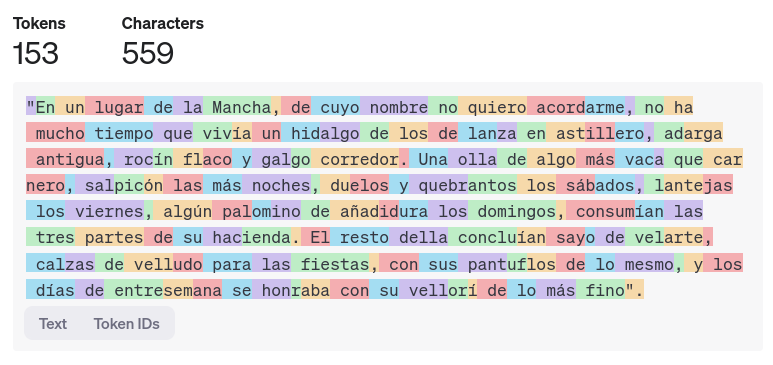
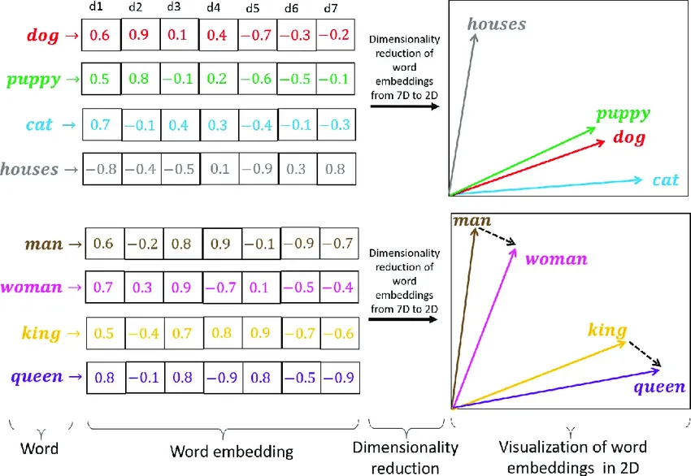

% Prompt Engineering
% Adolfo Sanz De Diego
% Diciembre 2024


# Introducción a Prompt Engineering


## ¿Qué es Prompt Engineering?

- **Definición**:
    - Técnica para diseñar y optimizar instrucciones dadas a un modelo de IA generativa.
- **Objetivo principal**:
    - Obtener resultados más precisos y útiles ajustando las entradas al modelo.
- **Ejemplo básico**:
    - Comparar "Resume el texto" vs. "Resume este artículo en 3 puntos clave para un público técnico".

## Importancia de los Prompts

- **Impacto directo en resultados**:
    - La calidad del prompt define la calidad de la salida generada.
- **Eficiencia**:
    - Prompts bien diseñados reducen iteraciones y ahorran tiempo.
- **Flexibilidad**:
    - Los prompts permiten personalizar respuestas según necesidades específicas.
- **Casos de uso clave**:
    - Redacción creativa, resolución de problemas, generación de código y más.

## Ejemplos para Desarrollo de Software (I)

- **Generación de Código**:
    - Crear funciones a partir de descripciones como: "Escribe una función Java que ordene una lista de números."
- **Documentación Automática**:
    - Generar documentación técnica basada en código existente.
- **Debugging**:
    - Pedir explicaciones sobre errores en fragmentos de código.

## Ejemplos para Desarrollo de Software (II)

- **Pruebas Automáticas**:
    - Crear casos de prueba a partir de requisitos específicos.
- **Optimización**:
    - Solicitar recomendaciones para mejorar el rendimiento de un fragmento de código.
- **Commits**:
    - Generar mensajes en los commits en función de las diferencias.


# Historia de los Modelos Generativos


## Hasta el 2017

- **Décadas tempranas**:
    - Los modelos de lenguaje comienzan con técnicas estadísticas simples.
- **Años 2010**:
    - Avances significativos gracias a redes neuronales.
- **2017**:
    - Publicación del artículo "Attention is All You Need", que introduce el mecanismo de atención y los modelos Transformer, revolucionando el campo.

## Desde el 2017

- **2018**:
    - OpenAI lanza GPT (Generative Pre-trained Transformer), demostrando el poder de los modelos de lenguaje preentrenados.
- **Años recientes**:
    - Surgen modelos más avanzados como DALL·E (Imagen), Codex (Código), Whisper (Transcripciones), Sora (Video), Suno (Música) y modelos multimodales, ampliando las aplicaciones de la IA generativa.


# Conceptos clave 


## Tokens (I)

- Las **unidades básicas que los modelos procesan**, como palabras, subpalabras o símbolos.
- Por ejemplo, "inteligencia" podría dividirse en varios tokens según el modelo.
- El coste de los modelos en la nube en forma de API suele ir por número de tokens procesados.

## Tokens (II)

<https://platform.openai.com/tokenizer>



## Embeddings (I)

- Es una **representación matemática que convierte datos complejos en vectores**, capturando similitudes y relaciones en un espacio multidimensional.
- Es fundamental en IA para reducir la complejidad y permitir que los modelos procesen texto, imágenes o audios de forma eficiente.
- Se usa en tareas como búsqueda semántica, sistemas de recomendación y clasificación, representando información de manera compacta y útil.

## Embeddings (II)



## Contexto

- Se refiere a la **información proporcionada como entrada** que guía la generación de respuestas.
- Incluye texto previo, instrucciones específicas y datos relevantes que ayudan al modelo a entender el propósito y mantener coherencia.
- Los modelos tienen un **límite de tokens** que pueden procesar en una sola interacción.

## Tipos de modelos generativos

- De texto a texto.
- De texto a imagen y de imagen a texto.
- De texto a audio y de audio a texto.
- De texto a video y de viideo a texto.
- Multimodales (pueden recibir texto, imágenes, vídeos, audios, etc.) y generan cualquier tipo de resultado.


# Características de un buen prompt


## Claridad y concisión

- Un buen prompt debe ser claro y directo.
- Evitar ambigüedades o términos que puedan ser interpretados de múltiples formas.
- Prompt: **"Explica qué es un algoritmo en 3 oraciones."**

## Contexto suficiente

- Proporcionar el contexto necesario para que la IA comprenda la intención del usuario.
- Incluir detalles relevantes como objetivos, audiencia, o formato deseado.
- Prompt: **"Describe cómo implementar un sistema de autenticación en una aplicación web usando OAuth 2.0."**

## Especificidad

- Detallar claramente lo que se espera en la respuesta.
- Evitar generalidades que puedan llevar a respuestas vagas o irrelevantes.
- Prompt: **"Escribe un fragmento de código en Java que ordene una lista de números usando el algoritmo de burbuja."**

## Estructura

- Formular el prompt con una estructura lógica y ordenada.
- Utilizar listas, preguntas claras o ejemplos para guiar a la IA.
- Prompt: **"Proporciona una tabla resumen de los beneficios de la arquitectura de microservicios. Organiza tu respuesta en: definición, ventajas, desafíos."**


# Tipos de prompts


## Directos

- Preguntas o comandos simples y directos.  
- Prompt: **"¿Qué es un sistema de control de versiones?"**

## Creativos

- Estimulan respuestas únicas o fuera de lo común.  
- Prompt: **"Imagina cómo sería un sistema operativo diseñado exclusivamente para robots domésticos."**

## Narrativos

- Orientados a desarrollar historias o explicaciones detalladas.
- Prompt: **"Describe cómo podría evolucionar la inteligencia artificial en los próximos 10 años en el campo del desarrollo de software."**

## Estructurados

- Usan un formato claro, como tablas, listas o párrafos con secciones específicas. 
- Prompt: **"Haz una tabla comparativa entre bases de datos relacionales y no relacionales con columnas para: características, ventajas, desventajas y ejemplos."**

## Reflexivos

- Invitan a un análisis profundo o comparaciones.
- Prompt: **"Compara los beneficios de usar Docker frente a máquinas virtuales tradicionales para el despliegue de aplicaciones."**


# Mejorar la precisión y relevancia de las respuestas


## Reformulación del prompt

- Reescribir el prompt para hacerlo más claro o específico.
- Evitar preguntas demasiado abiertas o genéricas.
- Prompt: En lugar de **"Explícame las bases de datos"**, usa **"Explica las principales diferencias entre bases de datos SQL y NoSQL, con ejemplos."**

## Uso de ejemplos

- Proporcionar ejemplos específicos en el prompt para orientar a la IA.
- Prompt: **"Genera un ejemplo de código en Java usando Spring de una clase EmployeeController con los métodos para exponer una API REST."**

## Definir el formato esperado

- Incluir en el prompt cómo debe estructurarse la respuesta (listas, párrafos, tablas, etc.).  
- Prompt: **"Crea una lista de 5 herramientas populares para gestión de proyectos de software con una breve descripción de cada una."**

## Iteración

- Si la respuesta inicial no es satisfactoria, ajustar el prompt con más detalles o nueva información.
- Prompt: Si **"Describe cómo funciona Git"** no da el nivel deseado de detalle, reformular a: **"Describe el flujo de trabajo básico de Git, incluyendo los comandos init, add, commit y push, con ejemplos."**

## Establecer límites o parámetros

- Definir restricciones como la longitud máxima de la respuesta o el tono deseado.  
- Prompt: **"Explica qué es Kubernetes en menos de 100 palabras y con un enfoque técnico."**


# Utilización de ejemplos en el Prompt


## Zero-Shot Prompting

- Solicitar directamente la tarea sin ejemplos previos.  
- Prompt: **"Explica qué es el paradigma de programación orientado a objetos."**

## One-Shot Prompting

- Proporcionar un ejemplo para guiar la respuesta.  
- Prompt: **"Escribe un ejemplo de código en Java que utilice un `HashMap` parecido al siguiente ejemplo:**
```java
ArrayList<String> estudiantes = new ArrayList<>();
estudiantes.add("Ana");
estudiantes.add("Carlos");
estudiantes.add("Lucía");
estudiantes.add("Miguel");
System.out.println("Lista de estudiantes:");
for (String estudiante : estudiantes) {
    System.out.println(estudiante);
}
```

## Few-Shot Prompting

- Ofrecer múltiples ejemplos para contextualizar mejor la tarea.  
- Prompt:  **"Escribe un ejemplo de código de bucle `do-while` en Java parecido a los siguientes ejemplos:**
**"**
```java
// Ejemplo 1: Un bucle `for` en Java.
for (int i = 0; i < 10; i++) {
    System.out.println(i);
}

// Ejemplo 2: Un bucle `while` en Java.
```java
int i = 0;
while (i < 10) {
    System.out.println(i);
    i++;
}
```


# Ajuste de las respuestas


## Ajuste del Tono

- Adaptar la formalidad o la calidez de la respuesta.  
- Prompt: **"Explica qué es un IDE en un tono amigable para principiantes."**

## Ajuste del Estilo

- Cambiar el formato o enfoque de la respuesta.  
- Prompt: **"Describe cómo funciona una `LinkedList` en Java, pero usa un estilo narrativo paso a paso."**

## Ajuste de la Formalidad

- Modificar el nivel de formalidad según el público objetivo.  
- Prompt: **"Describe el ciclo de vida de un objeto en Java con un tono académico."**

## Uso de Roles

- Asignar un rol específico al generador de contenido.  
- Prompt: **"Imagina que eres un instructor de Java. Explica cómo crear un programa que lea y escriba archivos de texto."**

## Adaptación a Públicos Específicos

- Personalizar la respuesta para una audiencia específica.  
- Prompt: **"Explica qué es un servidor web a estudiantes de informática con conocimiento básico de redes."**

## Uso de Plantillas

- Crear estructuras reutilizables para tareas frecuentes.  
- Prompt: **"Usa esta plantilla para responder:**
```  
- Introducción breve.  
- Explicación técnica.  
- Ejemplo práctico.  
```
**Pregunta: ¿Cómo funciona el garbage collector en Java?"**

## Uso de Delimitadores

- Delimitar entradas o contexto para mayor claridad.  
- Prompt: **"Responde '¿Qué hace este programa?' considerando únicamente el siguiente código:**
```java
class Example {
    public static void main(String[] args) {
        System.out.println("Hola, mundo!");
    }
}
```

## Prompts para Tareas Específicas

- Diseñar prompts para casos concretos.  
- Prompt: **"Escribe un código en Java que utilice el patrón de diseño Factory y explica brevemente su propósito."**


# Distintos Tonos y Estilos


## Formal

- Se utiliza para comunicar ideas con precisión, seriedad y profesionalismo.
- Prompt: **"Explique de manera detallada el uso de patrones de diseño en Java, incluyendo ejemplos específicos de implementación y sus beneficios en la arquitectura de software."**

## Conversacional

- Es amigable y cercano, ideal para mantener una interacción más relajada.
- Prompt: **"Oye, ¿podrías explicarme cómo usar interfaces en Java? Estoy un poco confundido sobre cuándo usarlas en lugar de herencia."**

## Educativo

- Orienta hacia la enseñanza y la claridad, adecuado para explicar conceptos paso a paso.
- Prompt: **"Crea una guía paso a paso para principiantes sobre cómo construir una aplicación Java básica que lea y escriba datos en un archivo."**

## Persuasivo  

- Busca convencer al lector o usuario de adoptar una idea, enfoque o herramienta.
- Prompt: **"Convénceme de por qué deberíamos usar Spring Framework en nuestro próximo proyecto de desarrollo en lugar de una solución personalizada en Java."**

## Humorístico

- Introduce ligereza o humor para hacer el contenido más atractivo y ameno.
- Prompt:  **"Explícame la diferencia entre una clase abstracta y una interfaz en Java, pero hazlo como si fueras un camarero explicando diferentes tipos de café."**

## Empático  

- Transmite apoyo y comprensión, ideal para conectar con los sentimientos del lector.
- Prompt:  **"Sé que puede ser abrumador aprender sobre colecciones en Java. ¿Podrías explicármelas de forma sencilla y darme algunos ejemplos prácticos?"**

## Entusiasta

- Muestra motivación y pasión, ideal para inspirar al lector o usuario.
- Prompt:  **"¡Explícame cómo implementar una API REST con Spring Boot! Estoy súper emocionado por empezar con Java en desarrollo backend."**

## Neutral  

- Proporciona información imparcial, precisa y sin juicios.
- Prompt: **"Proporcione un ejemplo de cómo implementar un patrón Singleton en Java, destacando sus ventajas y desventajas."**

## Creativo  

- Explora ideas innovadoras o contextos imaginativos para resolver problemas.
- Prompt: **"Imagina que estás desarrollando un juego de aventuras en Java. Escribe el código para una clase 'Hero' que pueda atacar, defenderse y ganar experiencia."**

## Autoritario

- Comunica seguridad y experiencia para guiar al lector con determinación.
- Prompt: **"Proporcione una guía definitiva sobre cómo configurar un entorno de desarrollo Java profesional, incluyendo IDE, gestión de dependencias y herramientas de prueba."**

## Directo

- Va al grano, ofreciendo respuestas rápidas y claras.
- Prompt: **"Dame un ejemplo simple de cómo usar un bucle 'for' en Java para recorrer una lista de números."**

## Inspirador

- Busca motivar al lector y estimular su confianza o creatividad.
- Prompt: **"Motiva a un desarrollador principiante en Java explicando cómo dominar este lenguaje puede abrir puertas en el desarrollo de aplicaciones empresariales y móviles."**

## Técnico

- Se enfoca en detalles complejos y específicos, usando lenguaje técnico.
- Prompt: **"Describa cómo funciona el recolector de basura en la JVM, incluyendo los distintos tipos de GC disponibles y cuándo utilizarlos, así como los distintos parámetros de configuración."**


# Técnicas Avanzadas de Prompt Engineering


## Cadena de Pensamiento (CoT)

- Descomponer una tarea compleja en pasos más pequeños y claros.  
- Prompt: **"Para implementar un patrón de diseño en Java, primero elige un patrón, luego define sus clases clave y finalmente implementa el comportamiento. Ejemplo: Diseña un patrón Singleton en Java."**

## Prompts Negativos

- Especificar qué no incluir en la respuesta.  
- Prompt: **"Explica cómo funciona un servidor HTTP en Java, pero no menciones frameworks como Spring."**

## Prompts Iterativos

- Refinar progresivamente las respuestas a través de ajustes iterativos.  
- Prompt: **"Proporciona una descripción de las estructuras de datos en Java.**
**...**
**Ahora amplía la explicación incluyendo ejemplos prácticos de uso."**