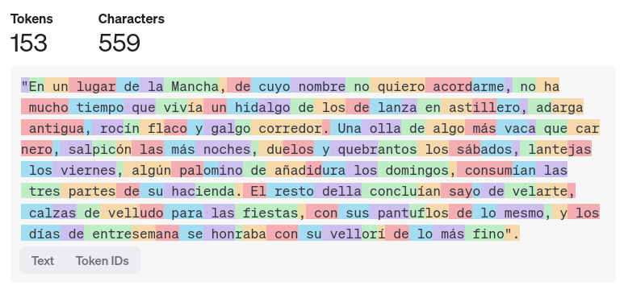

% Prompt Engineering
% Adolfo Sanz De Diego
% Diciembre 2024

# Introducción a Prompt Engineering

## ¿Qué es Prompt Engineering?

- **Definición**:
    - Técnica para diseñar y optimizar instrucciones dadas a un modelo de IA generativa.
- **Objetivo principal**:
    - Obtener resultados más precisos y útiles ajustando las entradas al modelo.
- **Ejemplo básico**:
    - Comparar "Resume el texto" vs. "Resume este artículo en 3 puntos clave para un público técnico".

## Importancia de los Prompts

- **Impacto directo en resultados**:
    - La calidad del prompt define la calidad de la salida generada.
- **Eficiencia**:
    - Prompts bien diseñados reducen iteraciones y ahorran tiempo.
- **Flexibilidad**:
    - Los prompts permiten personalizar respuestas según necesidades específicas.
- **Casos de uso clave**:
    - Redacción creativa, resolución de problemas, generación de código y más.

## Ejemplos para Desarrollo de Software (I)

- **Generación de Código**:
    - Crear funciones a partir de descripciones como: "Escribe una función Java que ordene una lista de números."
- **Documentación Automática**:
    - Generar documentación técnica basada en código existente.
- **Debugging**:
    - Pedir explicaciones sobre errores en fragmentos de código.

## Ejemplos para Desarrollo de Software (II)

- **Pruebas Automáticas**:
    - Crear casos de prueba a partir de requisitos específicos.
- **Optimización**:
    - Solicitar recomendaciones para mejorar el rendimiento de un fragmento de código.
- **Commits**:
    - Generar mensajes en los commits en función de las diferencias.

# Historia de los Modelos Generativos

## Hasta el 2017

- **Décadas tempranas**:
    - Los modelos de lenguaje comienzan con técnicas estadísticas simples.
- **Años 2010**:
    - Avances significativos gracias a redes neuronales.
- **2017**:
    - Publicación del artículo "Attention is All You Need", que introduce el mecanismo de atención y los modelos Transformer, revolucionando el campo.

## Desde el 2017

- **2018**:
    - OpenAI lanza GPT (Generative Pre-trained Transformer), demostrando el poder de los modelos de lenguaje preentrenados.
- **Años recientes**:
    - Surgen modelos más avanzados como DALL·E (Imagen), Codex (Código), Whisper (Transcripciones), Sora (Video), Suno (Música) y modelos multimodales, ampliando las aplicaciones de la IA generativa.

# Conceptos clave 

## Tokens (I)

- Las **unidades básicas que los modelos procesan**, como palabras, subpalabras o símbolos.
- Por ejemplo, "inteligencia" podría dividirse en varios tokens según el modelo.
- El coste de los modelos en la nube en forma de API suele ir por número de tokens procesados.

## Tokens (II)

<https://platform.openai.com/tokenizer>

## Embeddings (I)

- Es una **representación matemática que convierte datos complejos en vectores**, capturando similitudes y relaciones en un espacio multidimensional.
- Es fundamental en IA para reducir la complejidad y permitir que los modelos procesen texto, imágenes o audios de forma eficiente.
- Se usa en tareas como búsqueda semántica, sistemas de recomendación y clasificación, representando información de manera compacta y útil.

## Embeddings (II)

## Contexto

- Se refiere a la **información proporcionada como entrada** que guía la generación de respuestas.
- Incluye texto previo, instrucciones específicas y datos relevantes que ayudan al modelo a entender el propósito y mantener coherencia.
- Los modelos tienen un **límite de tokens** que pueden procesar en una sola interacción.

## Tipos de modelos generativos

- De texto a texto.
- De texto a imagen y de imagen a texto.
- De texto a audio y de audio a texto.
- De texto a video y de viideo a texto.
- Multimodales (pueden recibir texto, imágenes, vídeos, audios, etc.) y generan cualquier tipo de resultado.

# Características de un buen prompt

## Claridad y concisión

- Un buen prompt debe ser claro y directo.
- Evitar ambigüedades o términos que puedan ser interpretados de múltiples formas.

## Contexto suficiente

- Proporcionar el contexto necesario para que la IA comprenda la intención del usuario.
- Incluir detalles relevantes como objetivos, audiencia, o formato deseado.

## Especificidad

- Detallar claramente lo que se espera en la respuesta.
- Evitar generalidades que puedan llevar a respuestas vagas o irrelevantes.

## Estructura

- Formular el prompt con una estructura lógica y ordenada.
- Utilizar listas, preguntas claras o ejemplos para guiar a la IA.

# Tipos de prompts

## Directos

- Preguntas o comandos simples y directos.  

## Creativos

- Estimulan respuestas únicas o fuera de lo común.  

## Narrativos

- Orientados a desarrollar historias o explicaciones detalladas.

## Estructurados

- Usan un formato claro, como tablas, listas o párrafos con secciones específicas. 

## Reflexivos

- Invitan a un análisis profundo o comparaciones.

# Mejorar la precisión y relevancia de las respuestas

## Reformulación del prompt

- Reescribir el prompt para hacerlo más claro o específico.
- Evitar preguntas demasiado abiertas o genéricas.

## Uso de ejemplos

- Proporcionar ejemplos específicos en el prompt para orientar a la IA.

## Definir el formato esperado

- Incluir en el prompt cómo debe estructurarse la respuesta (listas, párrafos, tablas, etc.).  

## Iteración

- Si la respuesta inicial no es satisfactoria, ajustar el prompt con más detalles o nueva información.

## Establecer límites o parámetros

- Definir restricciones como la longitud máxima de la respuesta o el tono deseado.  

# Utilización de ejemplos en el Prompt

## Zero-Shot Prompting

- Solicitar directamente la tarea sin ejemplos previos.  

## One-Shot Prompting

- Proporcionar un ejemplo para guiar la respuesta.  

## Few-Shot Prompting

- Ofrecer múltiples ejemplos para contextualizar mejor la tarea.  

# Ajuste de las respuestas

## Ajuste del Tono

- Adaptar la formalidad o la calidez de la respuesta.  

## Ajuste del Estilo

- Cambiar el formato o enfoque de la respuesta.  

## Ajuste de la Formalidad

- Modificar el nivel de formalidad según el público objetivo.  

## Uso de Roles

- Asignar un rol específico al generador de contenido.  

## Adaptación a Públicos Específicos

- Personalizar la respuesta para una audiencia específica.  

## Uso de Plantillas

- Crear estructuras reutilizables para tareas frecuentes.  

## Uso de Delimitadores

- Delimitar entradas o contexto para mayor claridad.  

## Prompts para Tareas Específicas

- Diseñar prompts para casos concretos.  

# Distintos Tonos y Estilos

## Formal

- Se utiliza para comunicar ideas con precisión, seriedad y profesionalismo.

## Conversacional

- Es amigable y cercano, ideal para mantener una interacción más relajada.

## Educativo

- Orienta hacia la enseñanza y la claridad, adecuado para explicar conceptos paso a paso.

## Persuasivo  

- Busca convencer al lector o usuario de adoptar una idea, enfoque o herramienta.

## Humorístico

- Introduce ligereza o humor para hacer el contenido más atractivo y ameno.

## Empático  

- Transmite apoyo y comprensión, ideal para conectar con los sentimientos del lector.

## Entusiasta

- Muestra motivación y pasión, ideal para inspirar al lector o usuario.

## Neutral  

- Proporciona información imparcial, precisa y sin juicios.

## Creativo  

- Explora ideas innovadoras o contextos imaginativos para resolver problemas.

## Autoritario

- Comunica seguridad y experiencia para guiar al lector con determinación.

## Directo

- Va al grano, ofreciendo respuestas rápidas y claras.

## Inspirador

- Busca motivar al lector y estimular su confianza o creatividad.

## Técnico

- Se enfoca en detalles complejos y específicos, usando lenguaje técnico.

# Técnicas Avanzadas de Prompt Engineering

## Cadena de Pensamiento (CoT)

- Descomponer una tarea compleja en pasos más pequeños y claros.  

## Prompts Negativos

- Especificar qué no incluir en la respuesta.  

## Prompts Iterativos

- Refinar progresivamente las respuestas a través de ajustes iterativos.  